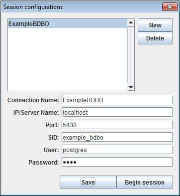
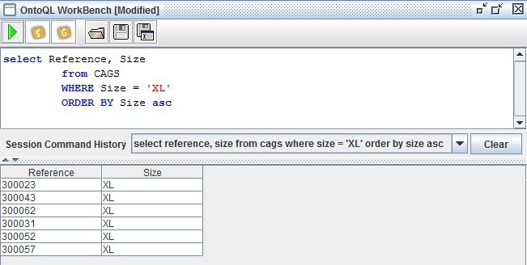
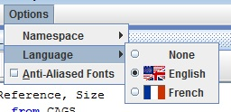

# This repository is for OntoQLPlus 2

You are looking at the repository of OntoQLPlus for OntoDB version 2. 

Please refer to [OntoDB repository](https://github.com/lias-laboratory/ontodb) to have a big picture of OntoDB ontology based database tool.

## Software requirements

* [OntoDBSchema V2](https://github.com/lias-laboratory/ontodbschema_v2)
* Java >= 8
* Maven (for compilation step)

## Compilation

* Compile the project.

```
$ mvn clean package
```

## Usage

We suppose that OntoDBSchema V2 is correctly installed. If not, please refer to this [page](https://github.com/lias-laboratory/ontodbschema_v2).

* Compile the project and deploy the artifcats to the local Maven repository.

An archive (_ontoqlplus-2.1-SNAPSHOT-dist.zip_) will be created at the _target/_ directory.

## User manual

### Starting OntoQLPlus

OntoQLPlus can be lunch by the _ontoqlplus.bat_ file contained into the _bin_ directory of the distribution.

### Connection to the Ontology database

The following dialog box is used to begin a connection to an ontology based database:



You must fill the fields on your connection according to the following exigences:

* *Connection Name*: give a name to this configuration
* *IP/Server Name*: host of the database
* *Port*: remote port used for the connection
* *SID*: identifier of the ontology database
* *User*: login of an account of the database
* *Password*: password of this account

Then you can click the save button to save this connection configuration or directly press the “Begin session” button to open a new connection. The buttons New and Delete are used to managed the saved connections.

### Executing OntoQL queries



An OntoQL query can be edited in the upper part of the screen and then executed using the green button above. The result is printed as a table in the lower part of the screen.

The session command history and save buttons can be used to keep trace of the OntoQL query executed.

### Changing the reference language

The reference language can be change in the _options -> language menu_:



## Software licence agreement

Details the license agreement of OntoQLPlus V1: [LICENCE](LICENCE)

## Code analysis

* Lines of Code: 3 640
* Programming Languages: Java

## Historic Contributors (core developers first followed by alphabetical order)

* [Stéphane JEAN(core developer)](https://www.lias-lab.fr/members/stephanejean/)
* [Mickael BARON(core developer)](https://www.lias-lab.fr/members/mickaelbaron/)
* [Yamine AIT-AMEUR](https://www.lias-lab.fr/members/yamineaitameur/)
* [Ladjel BELLATRECHE](https://www.lias-lab.fr/members/bellatreche/)
* [Guy PIERRA](https://www.lias-lab.fr/members/guypierra/)
